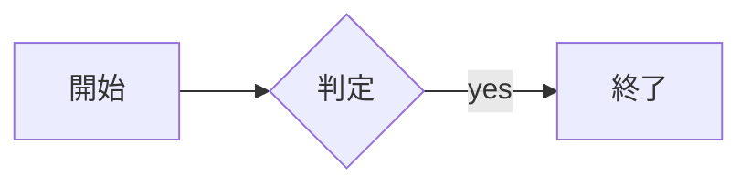
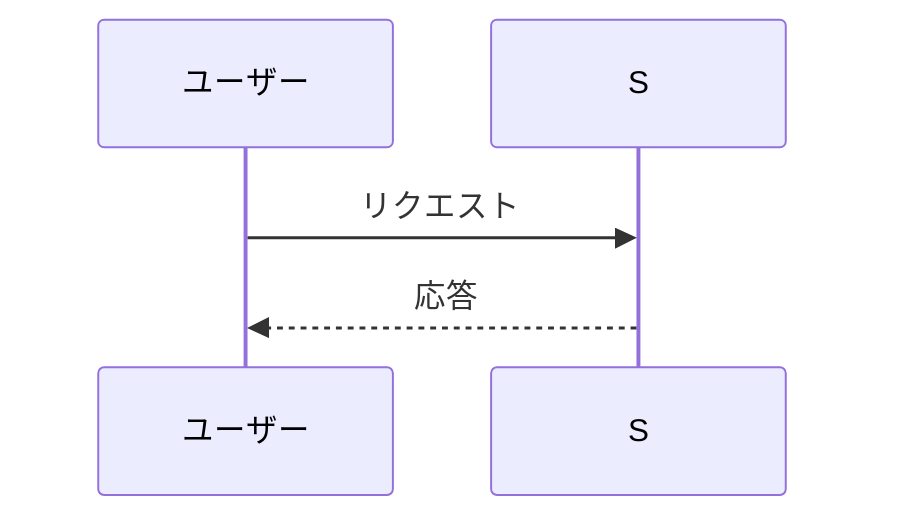

# doc-render スキル実装計画

> **For agentic workers:** REQUIRED SUB-SKILL: Use superpowers:subagent-driven-development (recommended) or superpowers:executing-plans to implement this plan task-by-task. Steps use checkbox (`- [ ]`) syntax for tracking.

**Goal:** mermaid 入り Markdown を日本語対応の PDF にレンダリングする doc-render スキルを実装し、実物資料(tmp.md)で E2E 検証する。

**Architecture:** uv スクリプト(render.py)が Markdown→単一HTML(GitHub風CSS+CJKフォント+mermaid.js インライン埋め込み)を生成し、Playwright Chromium でクライアントレンダリング後に print-to-PDF。mermaid.js は初回に CDN から `~/.local/share/doc-render/` へ取得・キャッシュ。

**Tech Stack:** Python 3.10+(uv PEP 723)、markdown-it-py(gfm-like)、Playwright Chromium(導入済み)、mermaid.js v11(キャッシュ)。

**Spec:** `docs/superpowers/specs/2026-06-13-doc-render-design.md` / **チケット:** agent-setup-8hl

---

### Task 1: render.py 本体

**Files:**
- Create: `skills/doc-render/scripts/render.py`(実行可能)

- [ ] **Step 1: スクリプト作成**

```python
#!/usr/bin/env -S uv run --script --quiet
# /// script
# requires-python = ">=3.10"
# dependencies = ["markdown-it-py[linkify]", "playwright"]
# ///
"""Markdown(mermaid フェンス対応)を A4 PDF にレンダリングする。

Usage: render.py <input.md> [output.pdf]

- frontmatter(doc-conventions 形式)は剥がし、title をヘッダに流用
- mermaid.js は初回に CDN から ~/.local/share/doc-render/ へ取得・キャッシュ
- 壊れた mermaid 図はその位置にエラー表示し、PDF 自体は生成する
"""
import datetime as dt
import html as html_mod
import re
import sys
import urllib.request
from pathlib import Path

MERMAID_VERSION = "11"  # メジャー固定(jsdelivr が 11.x 最新に解決)
CACHE_DIR = Path.home() / ".local/share/doc-render"
MERMAID_JS = CACHE_DIR / f"mermaid-v{MERMAID_VERSION}.min.js"
MERMAID_URL = f"https://cdn.jsdelivr.net/npm/mermaid@{MERMAID_VERSION}/dist/mermaid.min.js"

CSS = """
body { font-family: 'Noto Sans CJK JP','Noto Sans JP','Hiragino Sans','Yu Gothic',sans-serif;
       font-size: 10.5pt; line-height: 1.75; color: #1f2328; margin: 0; }
h1 { font-size: 1.7em; border-bottom: 1px solid #d1d9e0; padding-bottom: .3em; }
h2 { font-size: 1.35em; border-bottom: 1px solid #d1d9e0; padding-bottom: .25em;
     margin-top: 1.6em; break-after: avoid; }
h3 { font-size: 1.15em; margin-top: 1.4em; break-after: avoid; }
p { margin: .6em 0; }
code { font-family: 'Noto Sans Mono CJK JP','Cascadia Mono',monospace; font-size: .9em;
       background: #f0f1f3; padding: .15em .35em; border-radius: 4px; }
pre { background: #f6f8fa; padding: 12px; border-radius: 6px; overflow-x: hidden; }
pre code { background: none; padding: 0; white-space: pre-wrap; word-break: break-all; }
table { border-collapse: collapse; margin: .8em 0; width: 100%; }
th, td { border: 1px solid #d1d9e0; padding: 5px 10px; text-align: left; vertical-align: top; }
th { background: #f6f8fa; }
blockquote { border-left: 4px solid #d1d9e0; margin: .8em 0; padding: 0 1em; color: #59636e; }
.mermaid-figure { text-align: center; break-inside: avoid; margin: 1em 0; }
.mermaid-figure svg { max-width: 100%; height: auto; }
.mermaid-error { border: 2px solid #d1242f; background: #ffebe9; color: #d1242f;
                 padding: 10px; border-radius: 6px; font-size: .9em; white-space: pre-wrap; }
hr { border: 0; border-top: 1px solid #d1d9e0; margin: 1.5em 0; }
"""

RENDER_JS = """
mermaid.initialize({ startOnLoad: false, securityLevel: 'loose', theme: 'default' });
(async () => {
  const els = Array.from(document.querySelectorAll('pre.mermaid'));
  for (let i = 0; i < els.length; i++) {
    const el = els[i], id = 'mmd' + i;
    try {
      const { svg } = await mermaid.render(id, el.textContent);
      const fig = document.createElement('div');
      fig.className = 'mermaid-figure';
      fig.innerHTML = svg;
      el.replaceWith(fig);
    } catch (e) {
      const err = document.createElement('div');
      err.className = 'mermaid-error';
      err.textContent = '⚠ mermaid レンダリング失敗: ' + String((e && e.message) || e);
      el.replaceWith(err);
      const leftover = document.getElementById(id);
      if (leftover) leftover.remove();
    }
  }
  window.__render_done = true;
})();
"""


def ensure_mermaid_js() -> str:
    if not MERMAID_JS.exists():
        CACHE_DIR.mkdir(parents=True, exist_ok=True)
        print(f"mermaid.js を取得中: {MERMAID_URL}", file=sys.stderr)
        try:
            with urllib.request.urlopen(MERMAID_URL, timeout=60) as r:
                MERMAID_JS.write_bytes(r.read())
        except OSError as e:
            sys.exit(f"error: mermaid.js を取得できない({e})。ネット接続後に再実行するか、"
                     f"手動で {MERMAID_URL} を {MERMAID_JS} に保存してください")
    return MERMAID_JS.read_text(encoding="utf-8")


def split_frontmatter(text: str):
    if text.startswith("---\n"):
        end = text.find("\n---\n", 4)
        if end != -1:
            return text[4:end], text[end + 5:]
    return None, text


def extract_title(frontmatter, body: str, fallback: str) -> str:
    if frontmatter:
        m = re.search(r"^title:\s*(.+)$", frontmatter, re.M)
        if m:
            return m.group(1).strip().strip("\"'")
    m = re.search(r"^#\s+(.+)$", body, re.M)
    return m.group(1).strip() if m else fallback


def md_to_html(body: str) -> str:
    from markdown_it import MarkdownIt
    from markdown_it.renderer import RendererHTML

    md = MarkdownIt("gfm-like")
    default_fence = RendererHTML.fence

    def fence(self, tokens, idx, options, env):
        token = tokens[idx]
        if (token.info or "").strip().split(" ")[0] == "mermaid":
            return f'<pre class="mermaid">{html_mod.escape(token.content)}</pre>\n'
        return default_fence(self, tokens, idx, options, env)

    md.add_render_rule("fence", fence)
    return md.render(body)


def render_pdf(html_path: Path, pdf_path: Path, title: str):
    from playwright.sync_api import sync_playwright

    header = (f'<div style="font-size:8px; width:100%; padding:0 10mm; color:#59636e; '
              f'display:flex; justify-content:space-between;">'
              f'<span>{html_mod.escape(title)}</span>'
              f'<span>{dt.date.today().isoformat()}</span></div>')
    footer = ('<div style="font-size:8px; width:100%; text-align:center; color:#59636e;">'
              '<span class="pageNumber"></span> / <span class="totalPages"></span></div>')
    try:
        with sync_playwright() as p:
            browser = p.chromium.launch(headless=True)
            page = browser.new_page()
            page.goto(html_path.as_uri())
            page.wait_for_function("window.__render_done === true", timeout=120_000)
            page.pdf(path=str(pdf_path), format="A4", print_background=True,
                     display_header_footer=True,
                     header_template=header, footer_template=footer,
                     margin={"top": "18mm", "bottom": "16mm", "left": "14mm", "right": "14mm"})
            browser.close()
    except Exception as e:
        if "Executable doesn't exist" in str(e):
            sys.exit("error: Chromium 未導入。`uv run --with playwright playwright install chromium` を実行してください")
        raise


def main():
    if len(sys.argv) < 2:
        sys.exit("usage: render.py <input.md> [output.pdf]")
    src = Path(sys.argv[1]).resolve()
    if not src.is_file():
        sys.exit(f"error: 入力ファイルが無い: {src}")
    out = Path(sys.argv[2]).resolve() if len(sys.argv) > 2 else src.with_suffix(".pdf")

    text = src.read_text(encoding="utf-8")
    frontmatter, body = split_frontmatter(text)
    title = extract_title(frontmatter, body, src.stem)
    mermaid_js = ensure_mermaid_js()
    content = md_to_html(body)

    html = (f"<!doctype html><html><head><meta charset='utf-8'>"
            f"<title>{html_mod.escape(title)}</title><style>{CSS}</style></head>"
            f"<body>{content}"
            f"<script>{mermaid_js}</script><script>{RENDER_JS}</script></body></html>")
    html_path = out.with_suffix(".render.html")
    html_path.write_text(html, encoding="utf-8")
    try:
        render_pdf(html_path, out, title)
    finally:
        html_path.unlink(missing_ok=True)
    print(out)


if __name__ == "__main__":
    main()
```

- [ ] **Step 2: 実行権限付与**

Run: `chmod +x skills/doc-render/scripts/render.py`

---

### Task 2: 合成フィクスチャでの検証(spec 検証1・3)

**Files:** なし(/tmp に使い捨て)

- [ ] **Step 1: フィクスチャ作成**

```bash
cat > /tmp/render-fixture.md <<'EOF'
---
type: report
title: render検証レポート
---

# render検証レポート

日本語の本文と**強調**、`インラインコード`。

| 列A | 列B |
|---|---|
| 値1 | 値2 |





壊れた図(エラー表示になるべき):

```mermaid
flowchart LR
    A --> B -->>>> ???broken???
```

```python
def hello():
    print("コードブロック")
```
EOF
```

- [ ] **Step 2: 変換実行**

Run: `./skills/doc-render/scripts/render.py /tmp/render-fixture.md`
Expected: 初回は「mermaid.js を取得中」が stderr に出て、`/tmp/render-fixture.pdf` のパスが stdout に出る

- [ ] **Step 3: PDF 内容の確認**

```bash
pdftotext /tmp/render-fixture.pdf - | head -30   # 日本語テキストが抽出できる
pdftotext /tmp/render-fixture.pdf - | grep -c "レンダリング失敗"   # 1(壊れた図のエラー表示)
ls ~/.local/share/doc-render/   # mermaid-v11.min.js がキャッシュされている
```
Expected: 日本語が読める形で抽出され、エラー表示が1件、キャッシュ存在。図(SVG)はテキスト抽出に出ないので、ページ数と目視は E2E で確認

- [ ] **Step 4: コミット**

```bash
git add skills/doc-render/scripts/render.py
git commit -m "Add doc-render markdown-to-PDF converter"
```

---

### Task 3: SKILL.md と配線

**Files:**
- Create: `skills/doc-render/SKILL.md`
- Modify: `README.md`(スキル一覧表)

- [ ] **Step 1: SKILL.md 作成**

````markdown
---
name: doc-render
description: "Use when rendering Markdown to PDF for human review — レビュー資料・設計資料の Markdown(mermaid 図含む)を PDF にするとき。トリガー例: 「PDFにして」「レビュー用に出力して」「/doc-render <file.md>」。"
---

# doc-render

mermaid 図入りの Markdown を、日本語対応の A4 PDF にレンダリングする。

## 使い方

```bash
"$(find ~/.claude/skills/doc-render ~/.codex/skills/doc-render -name render.py 2>/dev/null | head -1)" <input.md> [output.pdf]
```

- 出力省略時は入力と同じ場所に `<name>.pdf`
- 初回実行時のみ mermaid.js を CDN から `~/.local/share/doc-render/` へ取得(以後オフライン)
- 壊れた mermaid 図はその位置に赤いエラーボックスで表示され、PDF 自体は生成される
- 要件: uv、Playwright Chromium(無ければ `uv run --with playwright playwright install chromium`)

## 複雑チケットのレビュー資料の書き方

複雑なチケット(epic、設計判断を含む作業)では、人間レビュー用の資料を書いてから変換する:

1. `docs/reports/YYYY-MM-DD-<topic>.md`(frontmatter `type: report`)に書く
2. 推奨構成: **背景 / 検討した選択肢と判断 / 構成図(mermaid)/ 影響範囲 / レビューで見てほしい点**
3. 変換して PDF パスを報告し、bd があるリポジトリでは `bd note <ticket-id> "レビュー資料: <path>"` で記録する
4. レビュー指摘は bd チケットに落とす(資料の修正は Markdown 側で行い、PDF は再生成する)
````

- [ ] **Step 2: README スキル一覧に行を追加**(doc-audit 行の下)

```markdown
| [doc-render](skills/doc-render/SKILL.md) | mermaid 入り Markdown を日本語対応 A4 PDF にレンダリング | uv、Playwright Chromium |
```

- [ ] **Step 3: install.sh 再実行と確認**

Run: `./install.sh && ls ~/.claude/skills/doc-render ~/.codex/skills/doc-render`
Expected: 両方に symlink

- [ ] **Step 4: コミット**

```bash
git add skills/doc-render/SKILL.md README.md
git commit -m "Add doc-render skill manifest and README entry"
```

---

### Task 4: 実物 E2E(spec 検証2)+ キャッシュ動作(spec 検証3)

**Files:** なし(出力は git 管理外の PDF)

- [ ] **Step 1: tmp.md を変換**

Run: `./skills/doc-render/scripts/render.py /home/tishi/prj/agent-setup/tmp.md`
Expected: 2回目以降なので mermaid.js 取得メッセージ無し(キャッシュ使用=検証3)。`tmp.pdf` のパスが出る

- [ ] **Step 2: 内容確認**

```bash
pdftotext tmp.pdf - | head -20        # 日本語見出しが抽出できる
uv run --with pypdf python -c "from pypdf import PdfReader; print(len(PdfReader('tmp.pdf').pages), 'pages')"
```
Expected: 全 mermaid 図がレンダリングされ、ページ数が妥当(38KB の md なら 10 ページ前後)

- [ ] **Step 3: ユーザーに目視確認を依頼**

tmp.pdf のパスを伝え、図のレンダリング品質・改ページ・日本語表示を確認してもらう。
注意: tmp.md / tmp.pdf はコミットしない(一時ファイル。必要なら .gitignore 確認)

---

### Task 5: Codex セルフレビューとクローズ

- [ ] **Step 1: コミット範囲レビュー**

```bash
git branch -f review-base <Task1開始前のHEAD>
codex review --base review-base --title "doc-render skill" > /tmp/codex-review-docrender.log 2>&1
git branch -D review-base
```
重大指摘は修正、軽微は bd 起票。

- [ ] **Step 2: チケットクローズ**

```bash
bd close agent-setup-8hl --reason "skills/doc-render として実装。合成フィクスチャ(日本語/表/mermaid 2種/壊れ図)+実物 tmp.md(38KB)で検証済み"
```

## 完了の定義

- spec 検証 1〜3 が合格(壊れ図はエラー表示・他は無事、tmp.md の PDF をユーザー目視確認、キャッシュでオフライン動作)
- README・install.sh 配線済み、working tree clean、チケットクローズ
